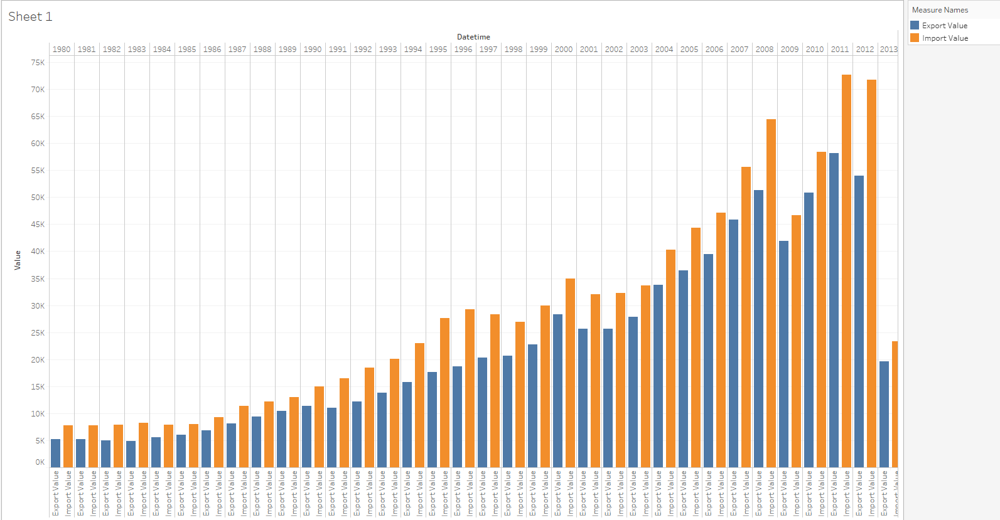
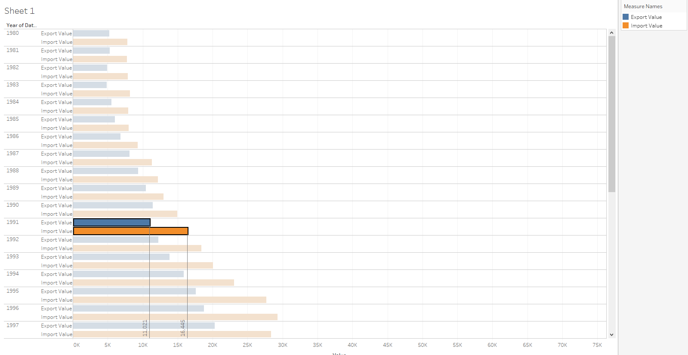

# Comparision of Two Metrics in One Bar Graph

## Overview

Build a report displaying monthly exports and imports.

## Data Source

- Tables: `bi.ex_net1.m` and `bi.im_net1.m`

## Steps

-Specify at least time/datetime and entity in INNER/FULL OUTER join
- Drag-and-drop _Datetime_ in to the column field
- Drag-and-drop both _Value_ in to the rows field
- Rename values. Right click on _Value_ and choose **Rename**
- Show Me Card > _side-by-side bars_ 

Enter `Ctrl+W` and swap columns and rows.

## Drop Lines

Add **Drop Lines** and **Labels**:

- Select a column
- Right click and choose **Drop Lines** > **Show Drop Lines**
- Right click and choose **Drop Lines** > **Edit Drop Lines** > **Labels** > **Automatic**

## Results

