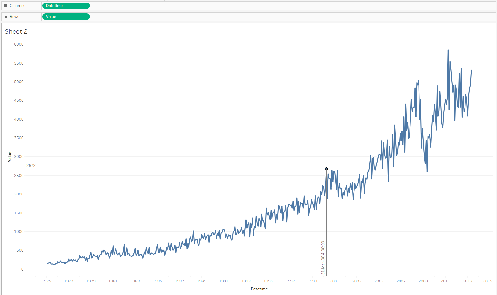

# Detailed values by date (no aggregation) for one metric

## Overview

There is example of visualization export statistics for several years.
 
## Data Source

* Table: `bi.im_net1.m`

## Steps

- Drag-and-drop _Datetime_ onto the columns field, change from **YEAR** aggregation to _Exact Date_ 
- Drag-and-drop _Value_ onto the rows field, change from **SUM** aggregation to _Dimension_
- Select _Line_ in drop-down at Marks Card
- Optionally add [drop lines](comparision_of_two_metrics_at_one_bar_graph.md#drop-lines)

## Results

