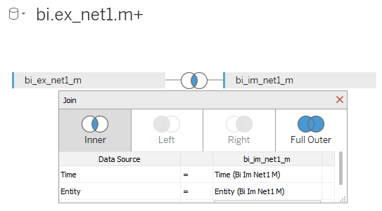
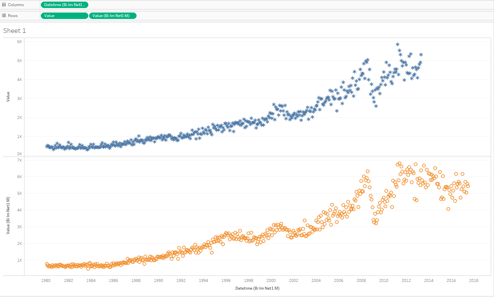

# Detailed Values by Date (No Aggregation) for Two Metrics

## Overview

Build a report displaying two metrics in one workspace.

## Data Source

- Tables: `bi.ex_net1.m` and `bi.im_net1.m`

## Steps

- Drag-and-drop both tables to the Data Source window.
- Select _Inner Join_, specify _Time_ and _Entity_ as equal fields:

- Specify at least time/datetime and entity, otherwise ATSD will raise an error.
- Drag-and-drop _Datetime_ in to the columns field (you can use any of _Datetime_), change from **YEAR** aggregation to _Exact Date_ 
- Drag-and-drop both _Value_ in to the rows field, change from **SUM** aggregation to _Dimension_
- Specify color: _Marks_ > _Value_ (you can use any of _Value_) > _Color_
- Specify shape: _Marks_ > _Value_ (you can use any of _Value_) > _Shape_

## Results

Compare the two metrics:

