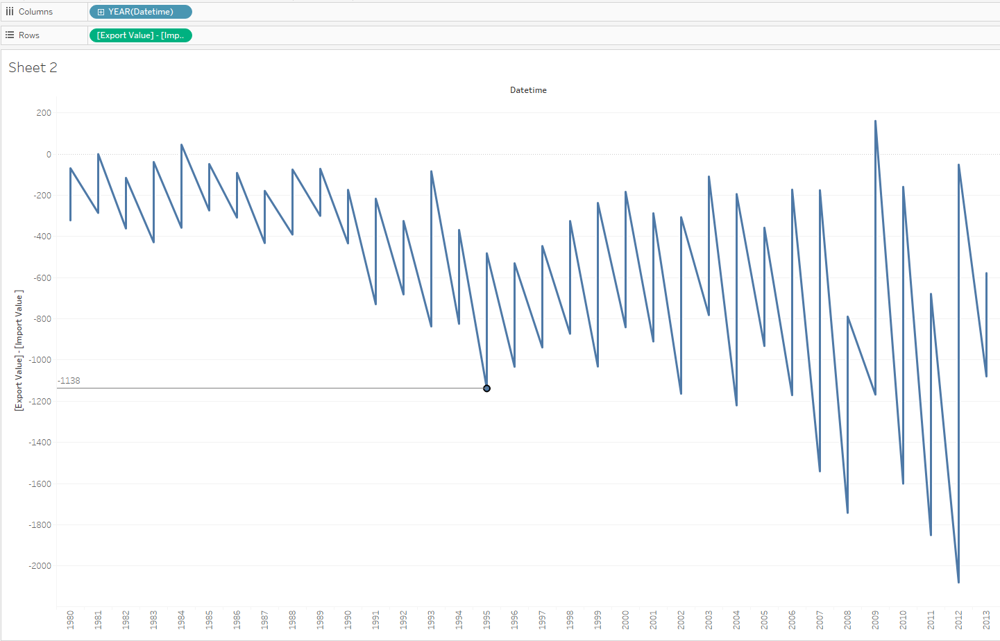

# Export - Import by year

## Overview

Build a report illustrating the difference between the export and import each year.

## Data Source

- Tables: `bi.ex_net1.m` and `bi.im_net1.m`

## Steps

- Specify at least time/datetime and entity in INNER/FULL OUTER join
- Drag-and-drop _Datetime_ onto the column field
- Rename both _Value_ into 'Export Value' and 'Import Value'
- Copy: _[Export Value] - [Import Value]_ > double click on the rows field > paste > **Enter**
- Right click on calculation > **Dimension**
- Select _Line_ in drop-down at Marks Card

## Results

