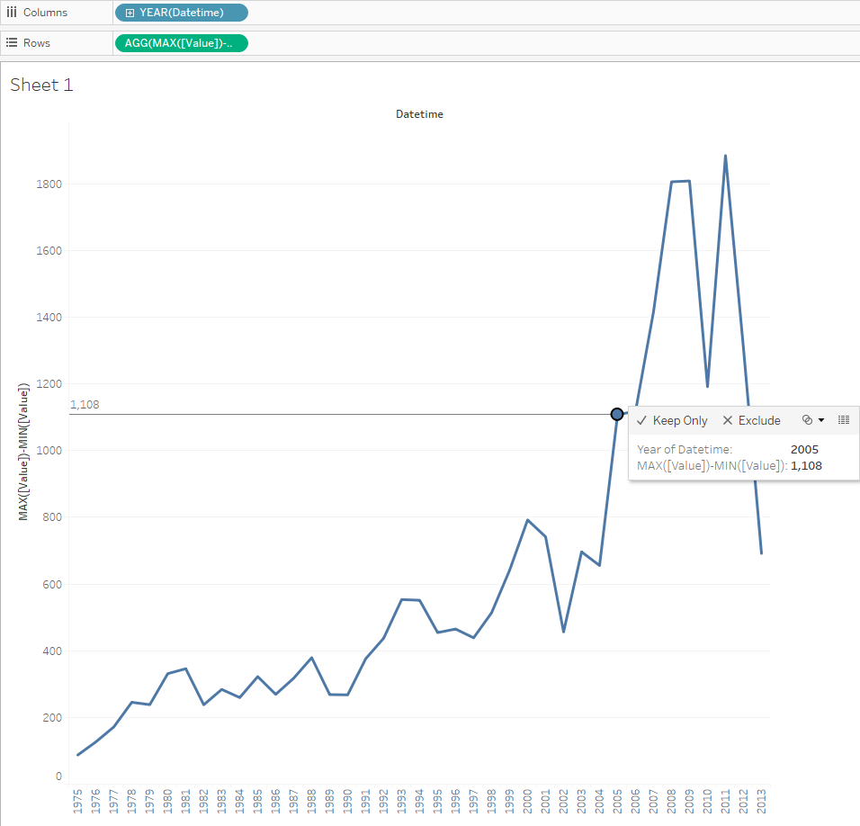

# MAX-MIN by year for one metric

## Overview

Report illustrating the difference between the maximum and minimum export value each year. 
 
## Data Source

* Table: `bi.ex_net1.m`
 
## Steps

- Drag-and-drop _Datetime_ onto the column field
- Copy: _MAX([Value])-MIN([Value])_ > double click on the rows field > paste > **Enter**
 
> MAX([Value])-MIN([Value]) is a customer calculation: Tableau provides a wide set of [Table Calculation Functions](http://onlinehelp.tableau.com/current/pro/desktop/en-us/functions_functions_tablecalculation.html)

## Results

