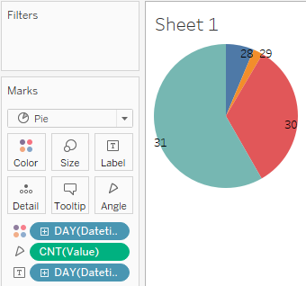

# Max Records by Day of Month

## Overview

Build a report showing the number of filings per day of month.
 
## Data Source

* Table: `bi.ex_net1.m`

## Steps

- Drag-and-drop the table to Canvas area
- Press **Sheet 1**
- Press **OK** to acknowledge the warning about limitations
- Drag-and-drop _Datetime_ to the Marks Card, right click on the _Year > Day_, replace _Detail_ with _Color_
- Drag-and-drop _Datetime_ to the Marks Card, right click on the _Year > Day_, replace _Detail_ with _Label_
- Change _Automatic_ to _Pie_ in drop-down at Marks Card
- Drag-and-drop _Value_ to the Marks Card, change aggregation from **SUM** to **COUNT**, replace _Detail_ with _Angle_
 
 ## Results
 
 Most records were reported on the 31st day of month:
 
 
