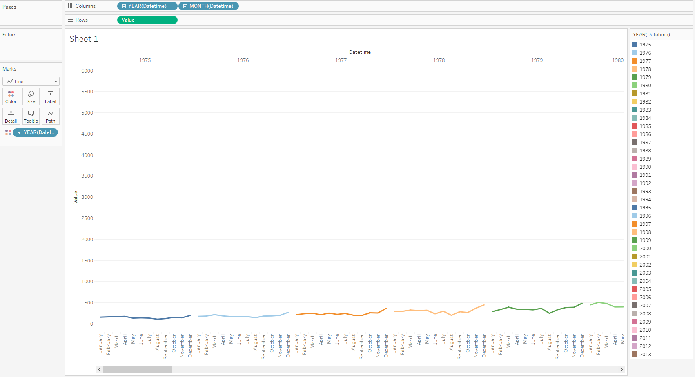
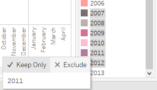
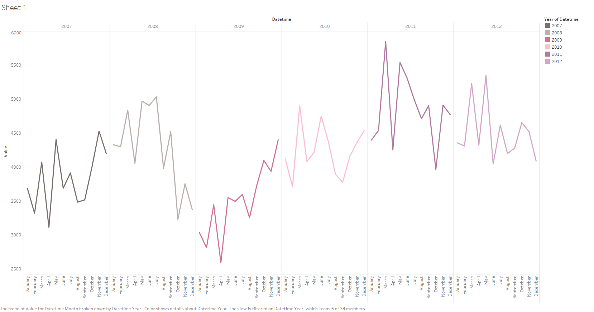

# MONTH and YEAR aggregation

## Data Source

* Table: `bi.ex_net1.m`

## Steps

- Drag-and-drop the table to Canvas area
- Press **Sheet 1**
- Press **OK** to acknowledge the warning about limitations
- Drag-and-drop _Datetime_ onto the columns field and _Value_ onto the rows field
- _Value_ > _Right-click_ > _Dimension_
- Marks Card > Drop-down > Line
- _YEAR > +_, right click on the _QUARTER > MONTH_
- Drag-and-drop _Datetime_ to the _Color_ (Marks Card), select **Add all members**

## Results

Review statistics for years 2007-2012:

- Select 2007-2012 rows in YEAR(Datetime) Card (right side of the window) > **Keep Only**

View results:

