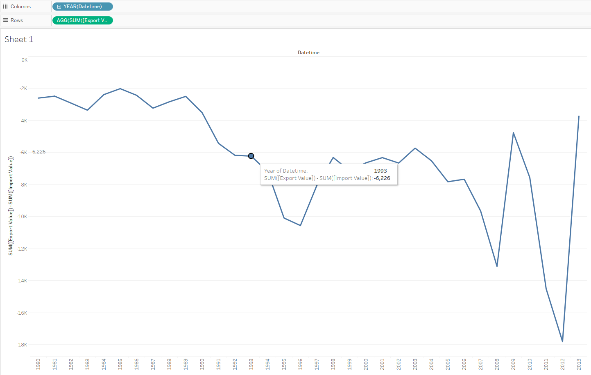

#  SUM(Export)-SUM(Import) by Year

## Data Source

* Tables: `bi.im_net1.m` and `bi.ex_net1.m`

## Steps

- Specify at least time/datetime and entity in INNER/FULL OUTER join
- Drag-and-drop _Datetime_ in to the column field
- Rename both _Value_ to 'Export Value' and 'Import Value'
- Copy: `SUM([Export Value]) - SUM([Import Value])` > double click on the rows field > paste > **Enter**

## Results

