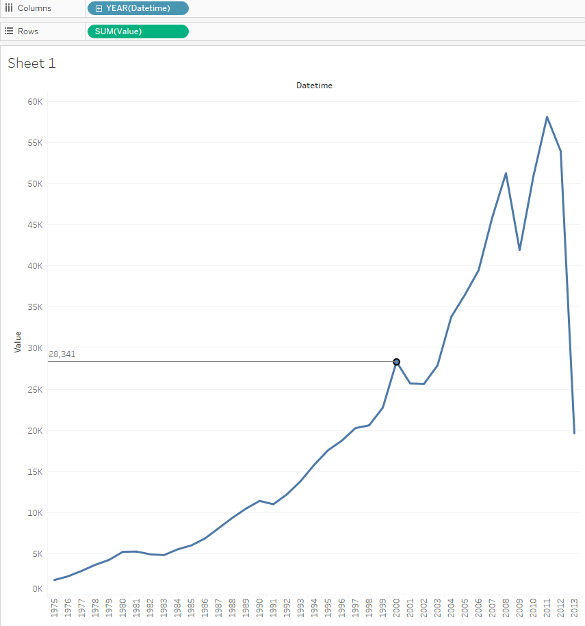

# SUM by year for one metric

## Overview

Report showing annual exports.

## Data Source

* Table: `bi.ex_net1.m`

## Steps

- Drag _Datetime_ onto the columns field
- Drag _Value_ onto the rows field
- Optionally add [drop lines](comparision_of_two_metrics_at_one_bar_graph.md#drop-lines)

## Results

