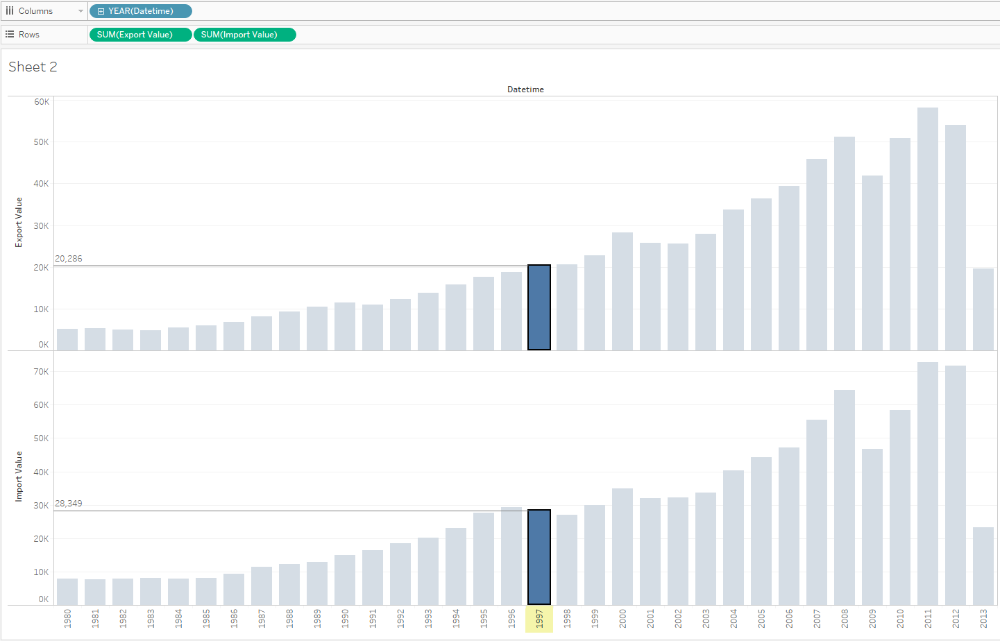

# SUM by year for two metrics

## Overview

Report showing the difference between two metrics on separate graphs.

## Data Source

* Tables: `bi.im_net1.m` and `bi.ex_net1.m`

## Steps

- Specify at least time/datetime and entity in INNER/FULL OUTER join
- Drag-and-drop _Datetime_ onto the column field
- Drag-and-drop both _Value_ onto the rows field
- Change _Automatic_ to _Bar_ in drop-down at _All_ section at Marks Card

## Results

