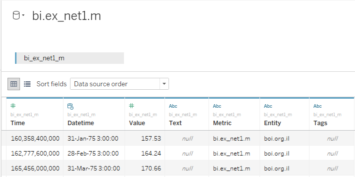
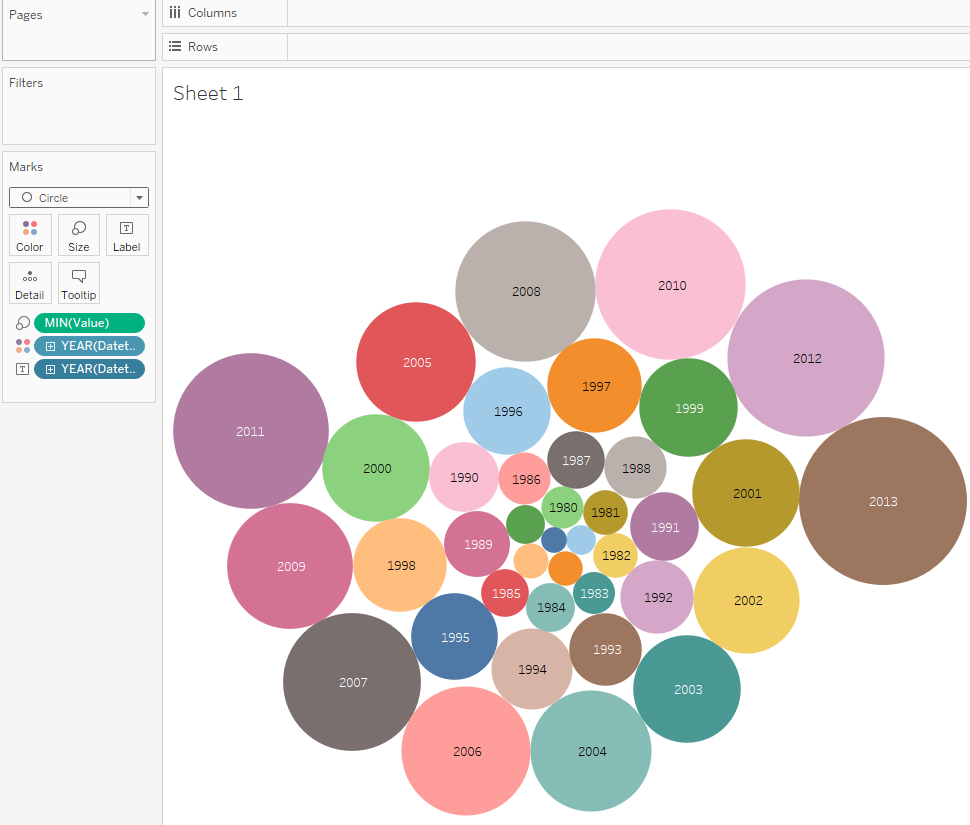
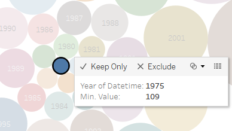

# Value Aggregation

## Overview

Display the minimum exports each year.

## Data Source

* Table: `bi.ex_net1.m`

## Steps

- Drag-and-drop _Value_ to the Marks Card, right click > **Measure** > **Count**, replace _Detail_ with _Size_
- Drag-and-drop _Datetime_ to the Marks Card, replace _Detail_ with _Color_
- Drag-and-drop _Datetime_ to the Marks Card, right-click on the _QUARTER > YEAR_, replace _Detail_ with _Label_
- Change _Automatic_ to _Circle_ in the dropdown at Marks Card

## Results

We can see that in 1975, the value was equal to 109 and it is the absolute minimum among all measures in the `bi.ex_net1.m` metric:

 
