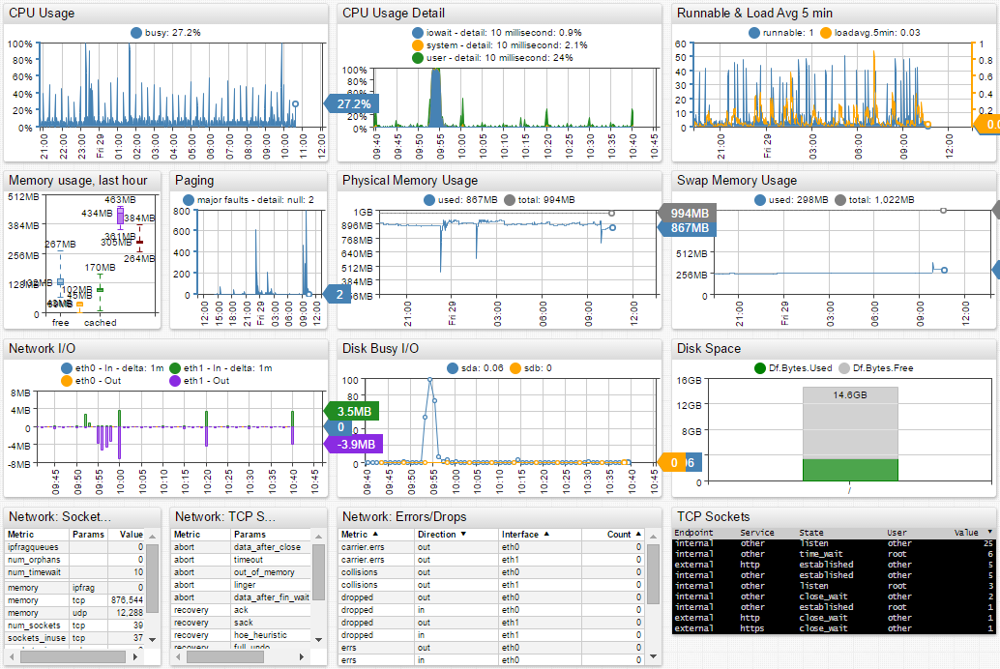

# tcollector

[tcollector](https://github.com/OpenTSDB/tcollector) is a data collection framework for Linux operating system. tcollector can be configured to stream data into the Axibase Time Series Database for storage, analysis, forecasting, and visualization.

To setup tcollector using Puppet, please use our guide and distribution on [GitHub](https://github.com/axibase/axibase-puppet-modules/tree/master/tcollector).

#### Setting up tcollector to Stream Data into ATSD

```sh
sudo apt-get update
sudo apt-get install git
git clone git://github.com/OpenTSDB/tcollector.git
cd tcollector
```

Modify startstop wrapper script by specifying the ATSD hostname and TCP port.

```sh
nano startstop
```

```sh
TSD_HOST=10.102.0.6
TSD_PORT=8081
...
ARGS="-c $TCOLLECTOR_PATH/collectors -H $TSD_HOST -p $TSD_PORT -t host=$HOSTNAME -P $PIDFILE --logfile $LOG"
```

Start tcollector:

```sh
sudo ./startstop start
```

tcollector documentation can be found here: [http://opentsdb.net/docs/build/html/user_guide/utilities/tcollector.html](http://opentsdb.net/docs/build/html/user_guide/utilities/tcollector.html)

To enable launching and auto-starting of tcollector both as a regular and a super user, read our [tcollector Startup guide](https://axibase.com/products/axibase-time-series-database/writing-data/tcollector/tcollector-startup/).

#### Default Entity Group and Portal for tcollector in ATSD

Entities collecting tcollector data are automatically grouped into the `tcollector - linux` entity group.

Entity Group Expression:

```
properties('tcollector').size() > 0
```

A default portal is assigned to the tcollector entity group called: `tcollector - Linux`.


Launch live tcollector portal in Axibase Chart Lab.

[Launch](https://apps.axibase.com/chartlab/bdad4416/3/)



#### List of tcollector metrics

```css
df.bytes.free	
df.bytes.percentused	
df.bytes.total	
df.bytes.used	
df.inodes.free	
df.inodes.percentused	
df.inodes.total	
df.inodes.used	
iostat.disk.await	
iostat.disk.ios_in_progress	
iostat.disk.msec_read	
iostat.disk.msec_total	
iostat.disk.msec_weighted_total	
iostat.disk.msec_write	
iostat.disk.r_await	
iostat.disk.read_merged	
iostat.disk.read_requests	
iostat.disk.read_sectors	
iostat.disk.svctm	
iostat.disk.util	
iostat.disk.w_await	
iostat.disk.write_merged	
iostat.disk.write_requests	
iostat.disk.write_sectors	
iostat.part.ios_in_progress	
iostat.part.msec_read	
iostat.part.msec_total	
iostat.part.msec_weighted_total	
iostat.part.msec_write	
iostat.part.read_merged	
iostat.part.read_requests	
iostat.part.read_sectors	
iostat.part.write_merged	
iostat.part.write_requests	
iostat.part.write_sectors	
net.sockstat.ipfragqueues	
net.sockstat.memory	
net.sockstat.num_orphans	
net.sockstat.num_sockets	
net.sockstat.num_timewait	
net.sockstat.sockets_inuse	
net.stat.tcp.abort	
net.stat.tcp.abort.failed	
net.stat.tcp.congestion.recovery	
net.stat.tcp.delayedack	
net.stat.tcp.failed_accept	
net.stat.tcp.invalid_sack	
net.stat.tcp.memory.pressure	
net.stat.tcp.memory.prune	
net.stat.tcp.packetloss.recovery	
net.stat.tcp.receive.queue.full	
net.stat.tcp.reording	
net.stat.tcp.retransmit	
net.stat.tcp.syncookies	
net.stat.udp.datagrams	
net.stat.udp.errors
sys.numa.allocation	
sys.numa.foreign_allocs	
sys.numa.interleave	
sys.numa.zoneallocs	
tcollector.collector.lines_invalid	
tcollector.collector.lines_received	
tcollector.collector.lines_sent	
tcollector.reader.lines_collected	
tcollector.reader.lines_dropped
```

```
proc.interrupts	
proc.kernel.entropy_avail	
proc.loadavg.15min	
proc.loadavg.1min	
proc.loadavg.5min	
proc.loadavg.runnable	
proc.loadavg.total_threads	
proc.meminfo.active	
proc.meminfo.anonhugepages	
proc.meminfo.anonpages	
proc.meminfo.bounce	
proc.meminfo.buffers	
proc.meminfo.cached	
proc.meminfo.commitlimit	
proc.meminfo.committed_as	
proc.meminfo.directmap2m	
proc.meminfo.directmap4k	
proc.meminfo.dirty	
proc.meminfo.hardwarecorrupted	
proc.meminfo.hugepagesize	
proc.meminfo.inactive	
proc.meminfo.kernelstack	
proc.meminfo.mapped	
proc.meminfo.memfree	
proc.meminfo.memtotal	
proc.meminfo.mlocked	
proc.meminfo.nfs_unstable	
proc.meminfo.pagetables	
proc.meminfo.shmem	
proc.meminfo.slab	
proc.meminfo.sreclaimable	
proc.meminfo.sunreclaim	
proc.meminfo.swapcached	
proc.meminfo.swapfree	
proc.meminfo.swaptotal	
proc.meminfo.unevictable	
proc.meminfo.vmallocchunk	
proc.meminfo.vmalloctotal	
proc.meminfo.vmallocused	
proc.meminfo.writeback	
proc.meminfo.writebacktmp	
proc.net.bytes	
proc.net.carrier.errs	
proc.net.collisions	
proc.net.compressed	
proc.net.dropped	
proc.net.errs	
proc.net.fifo.errs	
proc.net.frame.errs	
proc.net.multicast	
proc.net.packets	
proc.net.tcp	
proc.stat.cpu	
proc.stat.cpu.percpu	
proc.stat.ctxt	
proc.stat.intr	
proc.stat.processes	
proc.stat.procs_blocked	
proc.uptime.now	
proc.uptime.total	
proc.vmstat.pgfault	
proc.vmstat.pgmajfault	
proc.vmstat.pgpgin	
proc.vmstat.pgpgout	
proc.vmstat.pswpin	
proc.vmstat.pswpout
```
