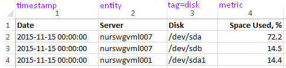
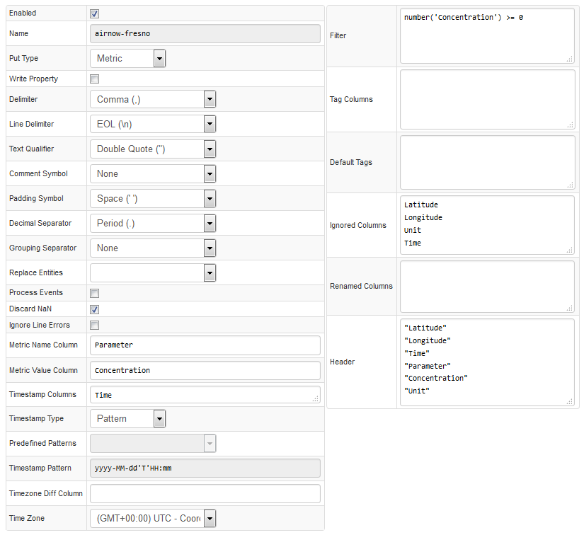

# Uploading CSV Files into Axibase Time Series Database

CSV files can be [uploaded](uploading-csv-files.md) into the Axibase Time Series Database via HTTP API or manually through the user interface.



Uploaded CSV files are processed by a user-defined CSV parser, which converts the text into a tabular model and creates series, properties, and message commands from cell values depending on the column name.

In addition to column-based parsing, ATSD supports [schema-based](csv-schema.md) parsing using [RFC 7111](https://tools.ietf.org/html/rfc7111#section-2) selections:

```ls
select("#row=2-*").select("#col=3-*").
addSeries().
metric(cell(1, col)).
entity(cell(row, 2)).
tag(cell(1, 3),cell(row, 3)).
timestamp(cell(row, 1));
```

Produced series commands:

```ls
series e:nurswgvml007 d:2015-11-15T00:00:00Z m:space_used_%=72.2 t:disk=/dev/sda
series e:nurswgvml007 d:2015-11-15T00:00:00Z m:space_used_%=14.5 t:disk=/dev/sdb
series e:nurswgvml001 d:2015-11-15T00:00:00Z m:space_used_%=14.4 t:disk=/dev/sda1
```

#### Configuration Settings

| Setting | Description |
| --- | --- |
|  Enabled  |  Parser status. If parser is disabled, uploaded CSV files referencing this parser will be discarded.  |
|  Name  |  Unique parser name used as identifier when uploading files.  |
|  Command Type  |  Type of data contained in the file: time series, properties, messages.  |
|  Write Property  |  Enable writing data both as series and as properties.  |
|  Entity Column  |  Name of column in CSV file containing the entities. For example: host or node.<br>Multiple columns can be specified in the Entity Column field in order to concatenate their values into a composite entity name using a dash symbol `–` as a token.<br>For example:<br>Souce CSV file:<br>`Year,Source,Destination,Travelers`<br>`1995,Moscow,Berlin,2000000`<br>Entity Columns:<br>`Source,Destination`<br>Resulting Entity:<br>`Moscow-Berlin`  |
|  Entity Prefix  |  Prefix added to entity names.  |
|  Default Entity  |  All data written to specific entity.  |
|  Replace Entities  |  Replace entity names in the input file with their aliases from the selected Replacement Table|
|  Process Events  |  Process incoming data in the [Rule Engine](/rule-engine) in addition to storing it in the database.  |
|  Metric Prefix  |  Prefix added to metric names.  |
|  Metric Name Column  |  Column containing metric names.  |
|  Metric Value Column  |  Column containing metric values.  |
|  Message Column  |  Column containing message text.  |
|  Timestamp Columns  |  Columns containing the Timestamp for each data sample. In some cases, depending on the CSV file, the Timestamp may be split into multiple columns. For example: Date, Time.<br>If there are two columns containing the Timestamp, then they are concatenated with a dash symbol (-) in the Timestamp Pattern field.<br>For example:<br>Source CSV File:<br>`Date,Time,Sensor,Power`<br>`2015.05.15,09:15:00,sensor01,15`<br>Timestamp Columns:<br>`Date,Time`<br>Result:<br>`Date-Time`<br>`2015.05.15-09:15:00`<br>Timestamp Pattern Setting:<br>`yyyy.MM.dd-HH:mm:ss`  |
|  Timestamp Type  |  Pattern, Seconds (Unix Seconds), Milliseconds (Unix Milliseconds).  |
|  Predefined Pattern  |  Predefined Timestamp formats.  |
|  Timestamp Pattern  |  Custom timestamp format, specified manually. For example: dd-MMM-yy. HH:mm:ss<br>If there are two columns containing the Timestamp, then in they are divided with a dash (-) in the pattern.  |
|  Timezone Diff Column  |  Column containing the time difference calculated from UTC.  |
|  Time Zone  |  Time zone for interpreting Timestamps.  |
|  Filter  |  Expression applied to row. If expression returns false, the row is discarded.<br>Filter syntax:<br>Fields:<br>timestamp – timestamp in milliseconds. Computed by parsing date from Time Column with specified Time Format and converted into milliseconds.<br>row[`columnName`] – text value of cell in columnName column.<br>Functions:<br>number(`columnName`) – returns numeric value of columnName cell, or NaN (Not a Number) if the cell contains unparsable text.<br>isNumber(`columnName`) – returns true if columnName cell is a valid number.<br>isBlank(`columnName`) – returns true is columnName cell is empty string.<br>upper(`columnName`) – converts columnName cell text to uppercase.<br>lower(`columnName`) – converts columnName cell text to lowercase.<br>date(`endtime expression`) – returns time in milliseconds.<br>Filter examples:<br>number(`columnName`) > 0<br>isNumber(`columnName`)<br>row[`columnName`] like 'abc*'<br>upper(`columnName`) != 'INVALID'<br>timestamp > date(`current_day`)<br>timestamp > date(`2015-08-15T00:00:00Z`)<br>timestamp > date(`now – 2 * year`)  |
|  Tag Columns  |  Columns converted to series tags.  |
|  Default Tags  |  Predefined series tags, specified as name=value on multiple lines.  |
|  Ignored Columns  |  List of columns ignored in `METRIC` and `MESSAGE` commands.<br>These columns are retained in `PROPERTY` commands.  |
|  Renamed Columns  |  List of column names to substitute input column headers, one mapping per line.<br>Usage: `inputname=storedname`  |
|  Header  |  Header to be used if the file contains no header or to replace existing header.  |
|  Schema  |  [Schema](csv-schema.md) defines how to process cells based on their position.  |


Columns contained in the CSV file that are not specified in any field in the parser will be imported as metrics.

#### Parse Settings

| Setting | Description |
| --- | --- |
|  Delimiter  |  Separator dividing values: comma, semicolon, or tab.  |
|  Line Delimiter  |  End-of-line symbol: EOL `(\n, \r\n)` or semicolon `;`  |
|  Text Qualifier  |  Escape character to differentiate separator as literal value.  |
|  Comment Symbol  |  Lines starting with comment symbol such as hash `#` are ignored.  |
|  Padding Symbol  |  Symbol appended to text values until all cells in the given column have the same width.<br>Applies to fixed-length formats such as `.dat` format.  |
|  Decimal Separator  |  Symbol used to mark the border between the integral and the fractional parts of a decimal numeral.<br>Default value: comma.<br>Possible values: period, comma.  |
|  Grouping Separator  |  Symbol used to group thousands within the number.<br>Default value: none.<br>Possible values: none, period, comma, space.  |
|  Fields Lengths  |  Width of columns in symbols. Padding symbols added to the end of the field to obey the fields lengths.<br>For files in `.dat` format.  |
|  Discard NaN  |  NaN (Not a Number) values will be discarded  |
|  Ignore Line Errors  |  If enabled, any errors while parsing the given line are ignored, including date parse errors, number parse errors, split errors, mismatch of rows, and header column counts.  |
|  Ignore Header Lines  |  Ignore Top-N lines from the file header  |




#### Column-based Parser Examples:


- [Weather Data](examples/weather.md)
- [Air Quality](examples/air-quality.md)


#### Schema-based Parser Examples:


- [Basic Example](examples/basic.md)
- [Columnar Format](examples/columnar-schema.md)
- [Columnar Period Format](examples/columnar-period-schema.md)
- [No Header](examples/no-header.md)
- [Multi-Column Timestamp](examples/multi-column-timestamp.md)
- [Multiple Metrics in Header](examples/multiple-metrics-in-header.md)
- [Metric Column](examples/metric-column-schema.md)
- [Messages](examples/message-schema.md)
- [Properties](examples/properties.md)
- [Messages with Filter](examples/message-with-filter-schema.md)
- [Series with Tags](examples/series-tags-schema.md)
- [notEmptyUp](examples/notemptyup-schema.md)
- [notEmptyLeft](examples/not-empty-left-schema.md)
- [Versioned Series](examples/versioned-series-schema.md)
- [Block-Appended](examples/block-appended-schema.md)
