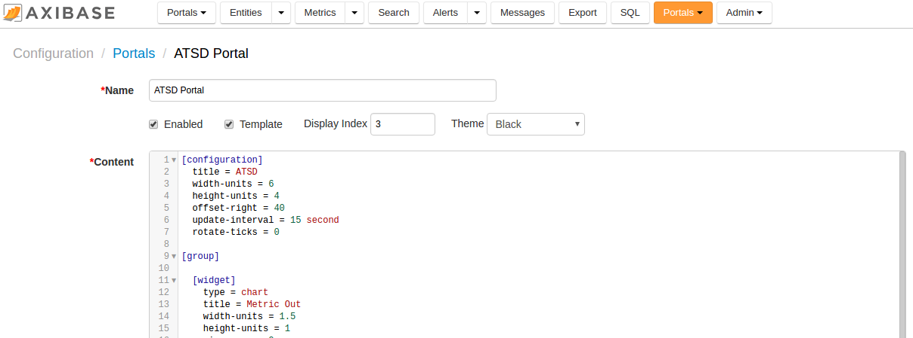
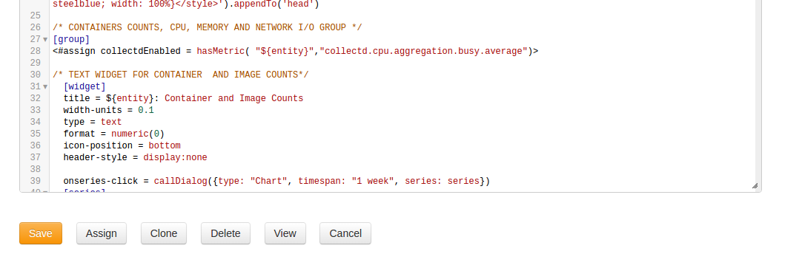

## Creating a New Portal

You can create personalized portals directly in the ATSD web interface using the [Visualization](http://axibase.com/products/axibase-time-series-database/visualization/) and [Widgets](http://axibase.com/products/axibase-time-series-database/visualization/widgets/) guides.

If you are creating a template portal, you will need to assign it to the necessary entities.

To create a new portal:

1. Log into ATSD.
2. From the top menu, click **Configuration > Portals**.
3. Scroll down to the bottom of the Portals page and click Create.
4. On the Portal Editor page, provide the following configuration and click Save.
    
    **Name**: provide a name for the new portal.
    
    **Enabled**: check the box to enable the portal (otherwise you will not be able to see the visualized data).
    
    **Template**: check the box if you want your new portal to be a template that you can later assign to various entities. Note that you will be able to change the portal type any time by checking or unchecking the box.
    
    **Display Index**: the index defines the order with which portals assigned to an entity are displayed. To view portals assigned to an entity:
    
      1. Click Entities from the top menu.
      2. Click the Portals icon next to the necessary entity.
      Each assigned portal will be displayed on a separate tab. The order of the tabs depends on the display index you specified.
    
    **Theme**: select one of the pre-configured themes for the new portal. The possible options are: Default and Black.
    Click [here](resources/black_portal.png) to view a portal with the Black theme applied or click [here](resources/default_portal.png) to view a portal with the Default theme.
    You can also create your own CSS and upload a folder with your personalized theme to `/opt/atsd/conf/portal/themes/`.
    After you upload your custom theme, it will appear in the list of available themes. To apply your style, select it from the Theme list.
    
    **Content**: specify settings for the portal itself and for widgets you'd like to add to the portal. For more information, see [Portal Layout](portal-settings.md).
    
    

### Learn How To

**[Build Portal Layout](http://axibase.com/products/axibase-time-series-database/visualization/widgets/portal-settings/)**

**[Create Generic Widgets](http://axibase.com/products/axibase-time-series-database/visualization/widgets/configuring-the-widgets/)**

**[Create Generic Tables](http://axibase.com/products/axibase-time-series-database/visualization/widgets/description-of-tables/)**

## Assigning the Portal to Entities

You can assign a portal using one of the following options.

#### Option 1: assign manually in the web interface

To assign a portal in the ATSD web interface:

1. From the top menu, click Configuration and select Portals.
2. Find the portal that you'd like to assign, and open its configuration.
3. At the bottom of the screen, below the configuration, click the Assign button.
4. Check the boxes next to the entity groups you'd like to assign the portal to.
5. Click Save at the bottom of the page.

#### Option 2: assign a portal with a URL

1. In the search bar of your browser, copy the link: [http://atsd_server:8088/portal/tabs?entity={entity}&id={id}](http://atsd_server:8088/portal/tabs?entity=%7bentity%7d&id=%7bid%7d).
2. Replace the entity (entity={entity}) and portal ID (id={id}) placeholders with the necessary values.
3. Press Enter.

##  Pre-Configured Single Entity and Metric Portals

In ATSD, you can generate single-entry, single-metric portals.

To load a portal, copy the following URL in the address bar. Replace the entry and metric placeholders with the necessary values.

[https://atsd.server.com:8088/portals/entity-and-metric?entity={entity}&metric={metric}](https://atsd.server.com:8088/portals/entity-and-metric?entity=%7bentity%7d&metric=%7bmetric%7d)

You can enable an *ad hoc* forecasting option by clicking **forecast** at the top right-hand corner of the pre-configured portal window.

