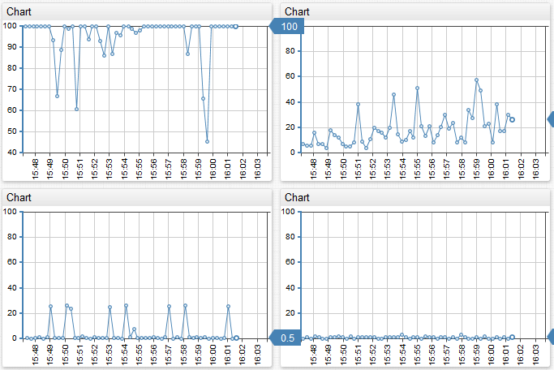

# Portal Layout

Widget are positioned on the portal page using a **grid** layout. The dimensions of the grid are specified under the `[configuration]` tag.

```
[configuration]
  width-units = 3
  height-units = 2
```

In this example, the page is split into 3 columns and 2 rows.

The default grid dimensions are 6×4. The default widget size is 1×1 and can be adjusted with the `width-units` and `height-units` settings.

To display multiple widgets on one row, group them using the `[group]` tag.

```
[configuration]
  width-units = 3
  height-units = 2
 
#1st line
[group]
  [widget]
  [widget]
  [widget]
 
#2nd line
[group]
  [widget]
  [widget]
  [widget]
```

As an alternative to creating groups for each row, add the `widgets-per-row` setting under the `[group]` tag.

```
[configuration]
  width-units = 3
  height-units = 2
 
[group]
  widgets-per-row = 3
  [widget]
  [widget]
  [widget]
  [widget]
  [widget]
  [widget]
```


[2x3 Group Layout (per row grouping)](http://apps.axibase.com/chartlab/adfe0fe2)


[3x2 Grid Layout (manual grouping)](http://apps.axibase.com/chartlab/adfe0fe2/18/)



#### [configuration] Settings

| Name | Example | Description | Chart Lab | 
| --- | --- | --- | --- | 
|  <p>title</p>  |  <p>`title = CPU Busy Portal`</p>  |  <p>Name of the portal.</p>  |  | 
|  <p>width-units </p>  |  <p>`width-units = 2`</p>  |  <p>Amount of horizontal blocks (9 by default).</p>  |  <p>[View](http://apps.axibase.com/chartlab/808e5846)</p>  | 
|  <p>height-units</p>  |  <p>`height-units = 2`</p>  |  <p>	Amount of vertical blocks (4 by default).</p>  |  <p>[View](http://apps.axibase.com/chartlab/808e5846/2/)</p>  | 
|  <p>offset-right</p>  |  <p>`offset-right = 50`</p>  |  <p>Determines the margin on the portal.</p>  <p>`offset-` can be used with: top, right, bottom, left.</p>  <p>Values specified in px.</p>  |  <p>[View](http://apps.axibase.com/chartlab/808e5846/10/)</p>  | 
|  <p>url</p>  |  <p>`url = http://hostname:port`</p>  |  <p>Link to ATSD server.</p>  |  | 
|  <p>url-parameters</p>  |  <p>`url-parameters = db=12&adapter=7`</p>  |  <p>Extra connection configurations.</p>  |  | 
|  <p>path</p>  |  <p>`path =`</p>  |  <p>Default path is `api/v1/series`.</p>  |  | 
|  <p>update-interval</p>  |  <p>`update-interval = 5 minute`</p>  |  <p>Polling interval at which new data is requested from the server by all widgets on the portal.</p>  <p>For example `update-interval = 5 minute`.</p>  <p>The default value is 1 minute.</p>  <p>The setting can be overridden for each widget separately.</p>  |  <p>[View](http://apps.axibase.com/chartlab/808e5846/3/)</p>  | 
|  <p>batch-update</p>  |  <p>`batch-update = true`</p>  |  <p>Sending series to the server in packets (false by default).</p>  <p>If equal to true, then the series, if during the last request to the server there was an error, will be sent one by one.</p>  |  <p>[View](http://apps.axibase.com/chartlab/808e5846/4/)</p>  | 
|  <p>batch-size</p>  |  <p>`batch-size = 1`</p>  |  <p>Maximum amount of series in one request to the server (8 by default).</p>  <p>If 0 is indicated, then the limit for the amount is not set.</p>  <p>Only accepted when the batch-update is equal to true.</p>  |  <p>[View](http://apps.axibase.com/chartlab/808e5846/5/)</p>  | 
|  <p>timespan</p>  |  <p>`timespan = 2 hour`</p>  |  <p>Allows to adjust the time-span that the whole portal displays, i.e. 1 hour, 1 day, all etc.</p>  <p>This can be set for the whole portal or for every widget individually.</p>  |  <p>[View](http://apps.axibase.com/chartlab/808e5846/6/)</p>  | 
|  <p>starttime</p>  |  <p>`starttime = 2015-04-01`</p>  |  <p>Specifies the date and time from which the values for the series are loaded.</p>  <p>This can be set for the whole portal or for every widget individually.</p>  <p>Syntax is shared with `endtime`.</p>  <p>NOTE: `starttime` is inclusive and `endtime` is exclusive.</p>  <p>This means that `startime = 2015-09-14 10:00:00` will include data points that occurred exactly at `10:00:00` and later.</p>  <p>`Endtime = 2015-09-14 11:00:00` will include data points that occurred up to `10:59:59`, excluding points that occurred at `11:00:00` and later.</p>  <p>Possible values described on the [End Time](https://axibase.com/products/axibase-time-series-database/visualization/end-time/) page.</p>  |  <p>[View](http://apps.axibase.com/chartlab/ca5669c8)</p>  | 
|  <p>endtime</p>  |  <p>`endtime = previous_working_day`</p>  |  <p>Specifies the date and time until which the values for the series are loaded.</p>  <p>This can be set for the whole portal or for every widget individually.</p>  <p>NOTE: `starttime` is inclusive and `endtime` is exclusive.</p>  <p>Meaning that `startime = 2015-09-14 10:00:00` will include data points that occurred exactly at `10:00:00` and later.</p>  <p>`Endtime = 2015-09-14 11:00:00` will include data points that occurred up to `10:59:59`, excluding points that occurred at `11:00:00` and later.</p>  <p>Possible values described on the [End Time](/products/axibase-time-series-database/visualization/end-time/) page.</p>  |  <p>[View](http://apps.axibase.com/chartlab/808e5846/7/)</p>  | 
|  <p>timezone</p>  |  <p>`timezone = UTC`</p>  |  <p>Set the timezone for the data being loaded into the portal.</p>  <p>If UTC is not set, then the portal is displayed in the local time zone.</p>  <p>Possible values: UTC.</p>  |  <p>[View](http://apps.axibase.com/chartlab/808e5846/8/)</p>  | 
|  <p>dialog-maximize</p>  |  <p>`dialog-maximize = true`</p>  |  <p>If set to true, the dialog window will open full-screen.</p>  <p>Dialog window can be opened by clicking on the widget title.</p>  <p>Possible values: true, false.</p>  <p>Default value: true.</p>  |  <p>[View](http://apps.axibase.com/chartlab/808e5846/14/)</p>  | 
|  <p>display-panels</p>  |  <p>`display-panels = true`</p>  |  <p>Display the controls of the widget.</p>  <p>Possible values: true, false, hover.</p>  |  <p>[View](http://apps.axibase.com/chartlab/808e5846/16/)</p>  | 
|  <p>expand-panels</p>  |  <p>`expand-panels = compact`</p>  |  <p>Expands the controls of the widget.</p>  <p>Possible values: all, compact, none.</p>  |  <p>[View](http://apps.axibase.com/chartlab/808e5846/18/)</p>  | 
|  <p>periods</p>  |  <p>`periods = 20 minute, 4 hour`</p>  |  <p>Add custom aggregation periods to aggregation controls in the top-right corner of the widget.</p>  |  <p>[View](http://apps.axibase.com/chartlab/fedaa42e/45/)</p>  | 
|  <p>buttons</p>  |  <p>`buttons = update`</p>  |  <p>Add buttons to the widget title (header), visible only on mouse-over.</p>  <p>Possible values: update, reset.</p>  <p>`update` stops/resumes the loading of fresh data into the widget.</p>  <p>Reset is only available for table widgets. Resets the sorting of columns.</p>  |  <p>[View](http://apps.axibase.com/chartlab/808e5846/12/)</p>  | 
|  <p>script</p>  |  <p>`script = defaultChartConfig.colors = ['olive']`</p>  |  <p>JavaScript code. Evaluated before the addition of widgets into the DOM of the browser.</p>  <p>Allows to reallocate the style of elements, and gives meaning by default for certain types of widgets or change to a certain widget.</p>  <p>If you show this parameter in the tag `[widget]`, then the argument widget will be given, being itself the main object of this widget and containing the main methods.</p>  |  <p>[View](http://apps.axibase.com/chartlab/808e5846/11/)</p>  | 


Freemarker expressions are supported when creating portals. [Learn how to use freemarker expressions in ATSD.](freemarker.md)

#### Configuration Example:

```
[configuration]
title = Title
width-units = 6
height-units = 3
url = http://atsd_server:port
url-parameters = db=12&adapter=7
```

#### Comments

**Single-line comments**

Single line comment starts with `#`. Text after `#` will be ignored.

```
[widget]
        type = chart   
        #metric field will be inherited by all series in the widget
	metric = nmon.cpu_total.busy%
```

Hash symbol in the middle of the line (preceded by any character other than tab or whitespace) is escaped and treated as regular text.

```
[widget]
        type = chart   
        #next line does not contain any comments because hash is preceded by characters other than tab or whitespace.
	title = Hello # World
```

**Multi-line comments**

Multi-line comments start with /* and end with */.

Any text between /* and */ will be ignored.

```
[widget]
        type = chart
    /*   
     type = bar
     title = Hello
    */  
	metric = nmon.cpu_total.busy%
```

#### Placeholders

You can insert placeholders into the configuration text to populate it with values of the request parameters. Placeholders have the `{placeholderName}` format. The value of the placeholder is parsed from the query string from any parameter starting with `p_`, i.e. `p_placeholderName`.

```
[series]
entity = {id}
metric = cpu_busy
```

Invoked with `?p_id=nurswgvml002`, the above configuration is converted into the following text:

```
[series]
entity = nurswgvml002
metric = cpu_busy
```

#### Script parameter in `[configuration]` tag

Script parameter can be used for a variety of purposes. It is recommended for advanced users.

Adding styles to a class:

```
script = d3.select('head').append('style').html('.axi-chart-series-alert{ stroke: red; stroke-width: 1.5; }')
```

To display no more than 5 elements for the control of all Time Charts, open the dialog box:

```
defaultDialogChart.script = widget.chart.panels.expand(5)
```

To hide the Stack button for all Bar Charts, which are not open in the dialog box:

```
defaultBarConfig.script = if (!dialog) widget.panels[0].destroy()
```
