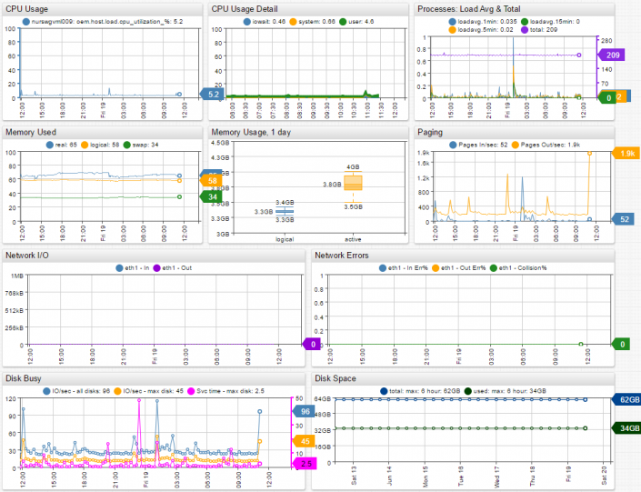
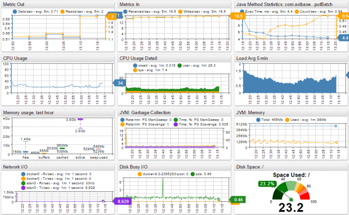
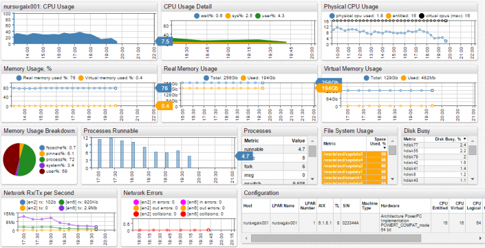

# Portals

ATSD Portal is a set of widgets that allows you to gather required data on one page and visualize critical metrics for more convenient monitoring and analysis.

Read this page to learn about ATSD portals and see [Creating and Assigning Portals](http://axibase.com/products/axibase-time-series-database/visualization/portals/creating-and-assigning-portals/) to learn how to work with portals.

### Key Features

- ATSD has a wide range of built-in portals that come standard out of the box. You don’t need to spend time on their configuration and modeling.
- You can create personalized portals that will include only your required widgets and metrics.
- Not only can you manage the information on your portal, but also manage the way your portal looks. You can choose a theme that comes standard with ATSD, or you can upload your own one.

Standard out of the box, ATSD contains over 20 built-in portals for:

- ATSD host system
- nmon
- Amazon Web Services
- cAdvisor
- docker
- SolarWinds
- tcollector
- VMware, etc.

ATSD has two types of portals:

- Default Portals
- Template Portals

Default Portals are automatically assigned to specific entities and entity groups. To learn more, see [Entities](https://axibase.com/products/axibase-time-series-database/data-model/entities/).

Right after creation, the portal will appear on the Portals tab at the top menu and will display entities, metrics, and tags as assigned by default.

Template Portals can be assigned to an unlimited number of entities and entity groups.

You can use placeholders while writing portal contents. When you assign a new portal to an entity, its name will automatically replace the placeholder.

## ATSD Built-in Portal Gallery

|  |  |  |
| --- | --- | --- |
| HP OpenView  | Oracle Host  | Oracle Databases  |
| cAdvisor Host  | cAdvisor Disk Detail  | cAdvisor Overview  | 
| SCOM SQL Server  | ATSD Host  | SolarWinds Base  | 
| tcollector  | VMware Host  | VMware Host VM Breakdown  |
| VMware Cluster  | Vmware VM  | SCOM Server 
| nmon AIX  |

### Learn How To

[Create and Assign Portals](http://axibase.com/products/axibase-time-series-database/visualization/portals/creating-and-assigning-portals/)

[Build Portal Layout](portal-settings.md)

[Create Generic Widgets](http://axibase.com/products/axibase-time-series-database/visualization/widgets/configuring-the-widgets/)

[Create Generic Tables](http://axibase.com/products/axibase-time-series-database/visualization/widgets/description-of-tables/)
