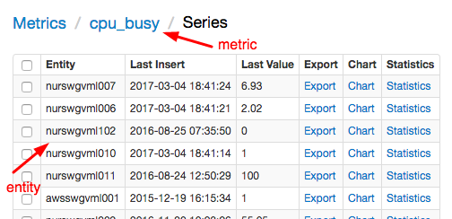
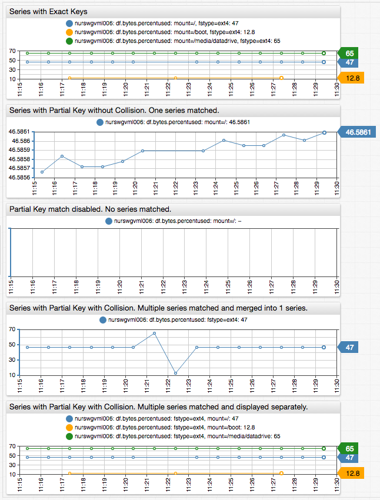
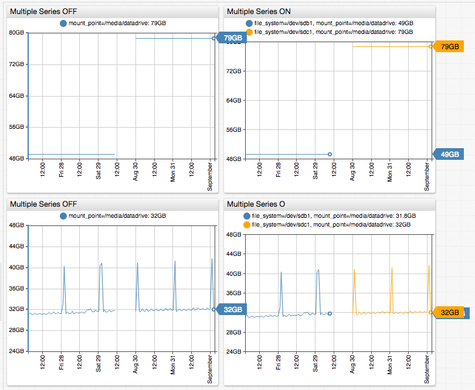
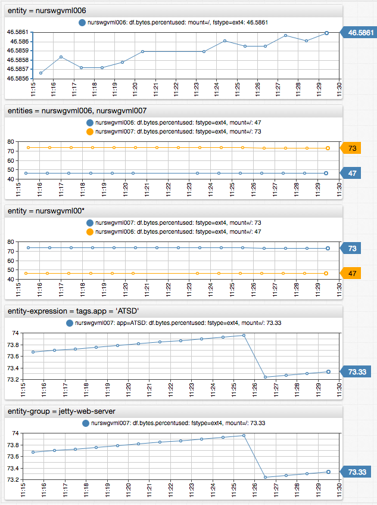
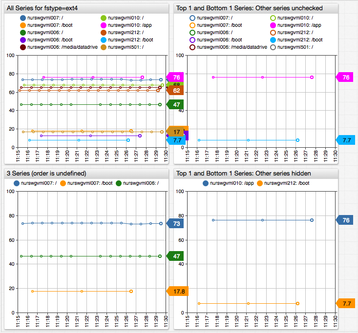

Selecting Series
===

### Database Schema

The Widget configuration syntax provides a way to load and display data for time series stored in a database. Series values 
change over time and their history is visualized with different types of graphs.

```ls
[widget]
  type = chart
# Widget settings
  [series]
# Series 1 settings
  [series]
# Series 2 settings
  ```
  
Each series is identified by a composite key which consists of an **metric**, **entity**, and optional key-value pairs 
called **series tags**, or simply **tags**. 

```ls
  [series]
    metric = cpu_busy
    entity = nurswgvml007
  [series]
    metric = df.bytes.percentused
    entity = nurswgvml006
    [tags]
      mount = /
      fstype = ext4
```

* An **entity** is a physical or logical object being monitored such as `nurswgvml007` (computer name).

* A **metric** represents the name of a measurable numeric attribute such as `cpu_busy` or `temperature`.

* **Series Tags** are optional. They provide additional level of detail for measurements, for example the disk’s mount point 
for the `df.bytes.percentused` metric.

An entity may be measured with a variety of metrics, just as the same metric could be collected for multiple entities.

### Exploring Series

Available series can be reviewed in the database on the **Metrics > metric > [Series]** page or on the **Entities > entity > Metrics > [Series]** page.

Alternatively, if the entity is already known, the metrics and series can be explored via a portal containing drop-down selectors.

[](https://apps.axibase.com/chartlab/d6e73e37/2)

### Selecting Specific Series

To display values for a specific series, the `[series]` section should specify its exact composite key which can be looked 
up in the database:

```ls
  # Series without Tags
  metric = cpu_busy
  entity = nurswgvml007
```



```ls
  # Series with Tags
  metric = df.bytes.percentused
  entity = nurswgvml006
  [tags]
    mount = /
    fstype = ext4
```


[](https://apps.axibase.com/chartlab/cdfb34c5/3)

### Selecting Multiple Series with Tags

By default, the database will return all series matching the request, including series with extra tags not enumerated in 
the request.

This enables loading series using only a subset of tags that are still sufficient to uniquely identify the series:

```ls
  # Series with Tags
  metric = df.bytes.percentused
  entity = nurswgvml006
  [tags]
    mount = /
```

The above configuration will match all series with `mount=/ tag`, **including** series that may have other tags.

To disable partial tag match, use the `'exact-match = true | false'` setting:

```ls
  # Series with Tags
  metric = df.bytes.percentused
  entity = nurswgvml006
  exact-match = true
  [tags]
    mount = /
```

When partial match is disabled, the database will return series with exactly the same combination of tags as specified in 
the request.

The partial match, while making the configuration compact, can produce undetermined results if the partial key matches multiple 
series where only one series is expected:

```sql
  # Series with Tags
  metric = df.bytes.percentused
  entity = nurswgvml006
  [tags]
    fstype = ext4
```

In the above example, the response will contain 3 different series with the same file system type ext4 but with different 
mount points: `/`, `/boot/`, `/media/datadrive`.

The resulting series is merged from 3 underlying different series and provides a meaningless result in this case.

[](https://apps.axibase.com/chartlab/cdfb34c5/7)

To control how multiple matched series are processed, use the `'multiple-series = true | false'` setting.

```ls
  # Display all series with tag fstype=ext4 without merging
  multiple-series = true
  [series]
    [tags]
      fstype = ext4
```

The `multiple-series` setting can be used to display all series without specifying any tags in widget configuration at all:

```  
   # Display all series without merging
     multiple-series = true
     [series]
```

The default value of the `multiple-series` setting is `true` in the following cases:

* Multiple entities are specified, for example `entity = nur1, nur2`

* Multiple tag values are specified, for example `[tags] mount = /, /tmp`

* Entity name contains wildcard, for example `entity = nur*`

* Tag value contains wildcard, for example `[tags] mount = /t*`

* `entity-expression`, `entity-group`, or `tag-expression` is present



```ls
# Select series using tag value wildcards. multiple-series is TRUE
  [tags]
    fstype = ext4  
    mount = *media*
 
# Select series with any value for the specified tag. multiple-series is TRUE
  [tags]
    fstype = ext4  
    mount = *
 
# Select series with any value for the specified tag. multiple-series is FALSE
  [tags]
    fstype = ext4  
 
# Select series with tag values from the specified list. multiple-series is TRUE
  [tags]
    fstype = cifs, autofs
 
# Select series with tag values matching specified wildcard patterns: multiple-series is TRUE
  [tags]
    fstype = cifs, auto*
 
# Select series with tags matching an expression: multiple-series is TRUE
  tag-expression = tags.mount NOT LIKE '/m*'
```


### Merging Series

Merging multiple series into one series could be a useful feature in situations where the underlying series describe the 
same object despite having different keys. Often, such series are recorded sequentially and therefore do not overlap.

**Examples**:

* /media/datadrive file system re-mounted on a larger disk and the mount point remains the same.

* Containers with different identifiers launched on schedule to perform a daily task.

* Measurements recorded during a set of scientific experiments are tagged with an experiment ID and input parameters.



[](https://apps.axibase.com/chartlab/cdfb34c5/15/)

### Selecting Series for Multiple Entities

The `[widget]` syntax provides a number of options to select series for multiple entities and the same metric:

```ls
  # Select specific entity by name
  entity = nurswgvml006
 
  # Select multiple entities by name using ? and * wildcards
  entity = nurswgvml*
 
  # Select all entities
  entity = *
 
  # Select an array of entities by name
  entities = nurswgvml006, nurswgvml007
 
  # Select an array of entities by name or pattern
  entities = nurswgvml111, nurswgvml00*
 
  # Select entities matching an expression referencing name, label, entity tags, properties
  entity-expression = tags.app = 'ATSD'
 
  # Select entities belonging to the specified entity group
  entity-group = nur-collectors
```

Refer to the [Data API](https://github.com/axibase/atsd/blob/master/api/data/filter-entity.md#entity-filter-fields) for additional information about these settings.

```ls
  # Retrieve series for entities starting with nurswgvml00
  [series]
   entity = nurswgvml00*
    [tags]
      mount = /
      fstype = ext4
```



[](https://apps.axibase.com/chartlab/cdfb34c5/8)

### Retrieving Series from the Database

As an alternative to specifying the `[series]` settings manually and using wildcards, the widget syntax provides the `getSeries()` and 
`getTags()` methods to retrieve the list of existing series from the database.

`getTags()`:

```ls
  var tags = getTags('df.bytes.percentused', 'mount', 'nurswgvml006')
 
  for tagValue in tags
    [series]
      [tags]
        mount = @{tagValue}
  endfor
```

`getSeries()`:

```ls
  var seriesList = getSeries('df.bytes.percentused', 'nurswgvml006')
 
  for sobj in seriesList
    [series]
      [tags]
      for tagName in Object.keys(sobj.tags)
        "@{tagName}" = @{sobj.tags[tagName]}
      endfor
  endfor
```

[](https://apps.axibase.com/chartlab/cdfb34c5/14/)

### Controlling Displayed Series

The `series-limit = int` setting enables limiting the number of possible series returned by the database for wildcard queries. 
Since the limit is applied to an unsorted list of matched series, the results may vary between requests, which makes the setting 
useful when exploring the dataset to prevent the widgets from loading too many series into browser memory.

```ls
  entity = *
  series-limit = 10
  [series]    
    [tags]
      fstype = ext4
```

For a more flexible visibility control on the client, use the display and enabled settings.

```ls
  entity = *
  display = value == top(1) || value == bottom(1)
  [series]    
    [tags]
      fstype = ext4
```



In addition, the `limit = int` setting can reduce the number of samples displayed for each series. It makes queries 
execute faster when loading data for high-frequency series from the server, in particular during design and validation stages.

[](https://apps.axibase.com/chartlab/cdfb34c5/13/)