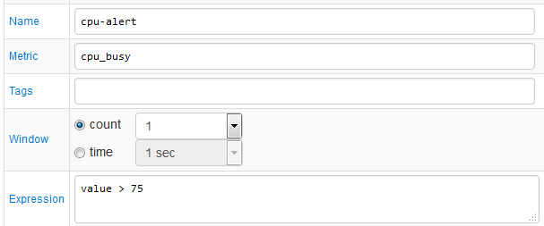
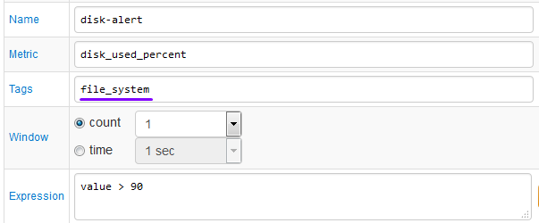
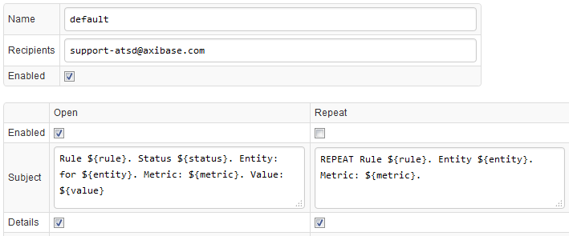

# Email Action

Email Action enables delivery of email messages to one or multiple
subscribers on window status changes based on incoming data.

| Window Status | Description |
| --- | --- |
| OPEN | Expression value changes from FALSE to TRUE |
| REPEAT | Expression value confirmed at TRUE on new data received or old data removed  from the window. |
| CANCEL | Expression value changes from FALSE to TRUE |

## Creating a Rule

To enable email notifications for a metric of interest, create a new
rule on the Rule Engine tab.

Specify rule name, metric name, and an expression to evaluate incoming
series samples. To receive an email message if value exceeds the
threshold, set window type to `count=1` and enter `value > {threshold}`
as expression.

Once the rule is active, you can verify its configuration by reviewing
records on Alerts tab. If the expected alerts are missing, verify that
the data has been received and check the expression formula.

Note that windows are reset to OPEN status whenever the rule is saved
from the editor.

## Partitioning Windows

By default, windows are partitioned by entity, which means that email
notifications will be generated for each entity separately.

If the underlying metric collects data with tags, specify their names in
the Tags field to partition windows by entity and tags. Otherwise, the
same window will be updated with series samples related to different
tags.

## Configuring Notifications

To enable notifications for the selected rule, open Email Notifications
tab, assign a name to the new configuration and specify one or multiple
email addresses.

Enter Subject text and click Enabled for each status change (OPEN,
REPEAT, CANCEL) that you would like to receive. Additionally, to enable
notifications on REPEAT status, set Repeat Interval to desired
notification frequency, for example, every 10-th sample or every 5
minutes.

The default Subject text is
`Rule ${rule}. Status ${status}. Entity: for ${entity}. Metric: ${metric}. Tags: ${tags}`

## Email Notification Settings

| Setting | Description |
| --- | --- |
| Name | User-defined email configuration name. Each rule can have multiple configurations which are executed independently on status changes. |
| Recipients | One or multiple email subscribers receiving the message. Use comma or semi-colon to separate multiple addresses. |
| Enabled | Enable or disable this configuration. |
| Use In Thresholds Only | If set to yes, this configuration will be activated only for override expressions specified under Thresholds tab. |
| Schedule | Cron expression to conditionally enable the configuration based on calendar. For example to activate the configuration during business hours, enter `* 8-18 * * MON-FRI`. |
| First Delay | Delay interval for sending notification for OPEN status. If the window changes to CANCEL status within the specified delay interval, no OPEN status email will be sent. Set this interval to prevent emails on short-lived spikes. |
| Repeat Interval | Interval for sending REPEAT status notifications. If Repeat Interval is set in time units, the exact interval may vary because the REPEAT notifications are triggered by incoming data. In particular, REPEAT notifications will not be sent If the data stops flowing in. |
| Merge | Merge multiple notifications from different rules into one email for the same subscriber to prevent too many emails arriving within a short time span. Note that message Subject is redefined for merged emails and reflects rule names, metric names and the total number of merged notifications in the given message, for example: Alerts(2)-cpu_busy: statistical-time, nmon_cpu |
| Priority | Message priority field to differentiate messages in common email clients: Low, Normal, High, |
| Message: Subject | Custom subject text for each status separately. List of supported placeholders is provided below. In addition to built-in placeholders you can use expressions containing built-in functions, for example: `${round(threshold_linear_time(99))/60}` or `${round(avg())}` |
| Message: Details | Embed a table containing series statistics and action links into the message text. |
| Message: Text | Custom message text for each status separately. List of supported placeholders is provided below. In addition to built-in placeholders you can use expressions containing built-in functions, for example: `${round(threshold_linear_time(99))/60}` or `${round(avg())}` |

## Email Message Placeholders

-   ${entity}
-   ${metric}
-   ${value}
-   ${message}
-   ${severity}
-   ${rule}
-   ${expression}
-   ${rule_filter}
-   ${repeat_count}
-   ${repeat_interval}
-   ${alert_open_time}
-   ${alert_duration}
-   ${window}
-   ${schedule}
-   ${status}
-   ${received_time}
-   ${event_time}
-   ${open_value}
-   ${alert_type}
-   ${min_interval_expired}
-   ${window_first_time}
-   ${threshold}
-   ${tags} and ${tags.tag_name}
-   ${entity_tags} and ${entity_tags.tag_name}
-   ${properties} and ${properties.key_name} or
    ${properties.tag_name}

## Email Alert Content Example

> An alert exception can be created using the ‘Exception’ link received in email notifications:

