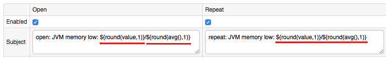
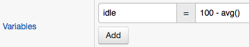

# Placeholders

Placeholders can be used to include fields and function values into email notifications and alert messages.
The placeholders are referenced using the `${name}` syntax.



## Placeholder List

### Generic Placeholders

**Name**|**Example**
:---|:---
alert_duration | 00:00:05:12
alert_duration_interval |
alert_message | Alert open: ${entity}, ${metric}, ${tags}.
alert_type | OPEN
columns | {memkb = round(value/1024)} - variables
entity | atsd
entity_label | Axibase TSD
entity_tags | {version=community}
entity_tags.tag_name | community
event_tags | {location=dc-5}
expression | value < 512*1024*1024
metric | jvm_memory_free
min_interval_expired | true
open_value | 3103100000
properties |
repeat_count | 0
repeat_interval | 1 MINUTE
rule | memory_low
rule_expression | value < 512*1024*1024
rule_filter | entity != 'nurswghbs001'
rule_name | memory_low
schedule | * * * * MON-FRI
severity | warning
status | OPEN
tags.tag_name | nurswgvml003
tags | host=nurswgvml003
timestamp | 145678784500 (Unix milliseconds)
value | 3103100000
window | length(1)
threshold | max() > 20

### Series Placeholders

* open_value
* value

### Message Placeholders

* message
* severity

### Properties Placeholders

* properties
* properties.key_name
* properties.tag_name
* type

### Time Placeholders

> `_time` placeholders contain time in local server timezone (2017-05-30 14:05:39 PST), `_datetime` - in ISO8601 UTC (2017-05-30T06:05:39Z)

* alert_open_time
* alert_open_datetime
* received_time
* received_datetime
* event_time
* event_datetime
* window_first_time
* window_first_datetime

### Custom Variables

Variables defined on the Overview tab can be referenced by name (similar to built-in fields).

```sh
${idle}
```



## Examples

```sh
[${status}] ActiveMQ on ${entity}:
Unauthorized connection from ${tags.remoteaddress}.
```

```sh
[${status}] JVM on ${entity}:
Average CPU usage ${round(avg()*100,1)} exceeds threshold.
```

```sh
${tags.file_system}
```

```sh
${entity.tags.location}
```

```sh
${tags}
```
