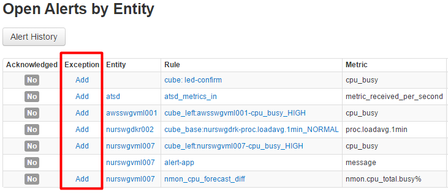

RULE ENGINE
===========

Rule Engine implemented in Axibase Time-Series Database enables
automation of repetitive tasks based on analysis of incoming data. Such
tasks may include raising a support ticket if power usage is abnormal or
[sending an
email](http://axibase.com/products/axibase-time-series-database/rule-engine/email-action/ "Email Action")
and executing a system command to clear /tmp directory if free disk
space is low.

In simple terms, the rule engine evaluates a set of IF/THEN statements:

    IF condition THEN action

When the expression specified in the rule evaluates to true, one or
multiple automation procedures are triggered. For instance:

    IF avg(value) > 75 THEN send_email

**In-Memory Processing**

The data is processed by the Rule Engine in-memory which operates
independently of storage, messaging, and replication channels. If the
received data passes through the filters it is added to matching sliding
windows partitioned (grouped) by metric, entity, and tags. The windows
are continuously updated as new elements are added and old elements are
removed to maintain window size at constant interval length or element
count. The window does not maintain a copy of received data in memory
unless it is required by functions specified in the expression. For
example, except for percentile() function, summary statistics for each
window can be re-computed without maintaining input data in memory.

**Window Types**

Windows can be count-based or time-based. A count-based window maintains
an ordered array of elements. Once the array reaches the specified
length, new elements replace oldest elements. A time-based window
includes all elements that are timestamped within the time interval that
ends with current time and starts with current time minus specified
window interval. For example, a 5-minute time-based window includes all
elements that arrived over the last 5 minutes. As the current time
increases, the start time is incremented accordingly as if the window is
‘sliding’ along the timeline.

**Window Status**

Windows are stateful. Once the expression for the given window evaluates
to TRUE, it is maintained in memory with status OPEN. On subsequent TRUE
evaluations the status is changed to REPEAT and when the expression
finally changes to FALSE, the status is set to CANCEL. Window state is
not stored in the database and windows are recreated with new data if
ATSD is restarted. By maintaining status in memory while the condition
is TRUE enables deduplication and supports flexible action programming.
For example, some actions can be configured to execute only on OPEN
status, while others can run on every n-th REPEAT occurrence.

**Expressions**

Expressions represent statements that return a boolean value: TRUE or
FALSE.

    percentile(value, 95) > 80

Expressions can reference built-in statistical functions that operate on
in-memory data as well as functions that fetch historical data too large
to fit into application memory. The list of functions and operators is
specific to the type of received data: time-series, properties, or
message.

**Developing Rules**

Rules are typically developed by system engineers with specialized
knowledge in their respective subject matter domains. Rules can be also
created post-mortem to prevent newly discovered problems from
re-occurring. Usually rules cover a small subset of key performance
indicators (KPIs) to minimize the maintenance effort. As the coverage
increases, the rule engine evolves into a fine-tuned expert system
tailored at specific customer requirements.

In order to minimize the number of rules with manual thresholds, ATSD
Rule Engine provides the following capabilities:

-   Automated thresholding using forecast() function
-   Override tables with support for wildcards

**Thresholds**

Thresholds specified in expressions can be set manually or using the
forecast function. For example, the following rule fires if observed
moving average deviates from expected forecast value by more than 25
percent in any direction.

    abs(avg() - forecast()) > 25

If the confidence interval (25% in example above) varies substantially
for different entities, forecast\_deviation function can be used to
compare actual and expected values in terms of standard deviation
specific for each time series:

    abs(forecast_deviation(avg())) > 2

Manually specified thresholds can be made more specific for an entity or
an entity group by adding an exception to the Thresholds table. The
exception can be also added by clicking on Exception link in alert
console or email alert.

##### Sliding Windows

ATSD Rule Engine uses two types of windows when ingesting statistics:
count and time. These windows are used to calculate aggregations and
only the statistics present in these windows are analyzed by the Rule
Engine.

**Time Based Windows – 3 second window example**

Time based windows analyze statistics that occurred in the last N
seconds. The time windows doesn’t limit how many samples can be held in
the list, however it automatically removes data samples that become
outside of the time interval as time passes.

**Count Based Windows – 3 event window example**

Count based windows analyze the last N events (data points) regardless
of when they occurred. The count window holds up to N data samples which
aggregate calculation such as average can be applied. When the
count window becomes full, the oldest (last) data sample is removed to
free up space for a new sample.

##### Rule Editor Settings:

Setting

Description

Enabled

is the rule active or not.

Name

Rule name must be unique. Multiple rules can be created for the same
metric.\
 Rule names cannot be modified once a rule is created so it’s advisable
to establish a naming convention, for example
`{metric}.{condition}.{application/service}`.\
 Example: `cpu_busy.high.ERP-production`.

Last Update

date and time when the rule was last modified.

Author

Optional user identifier to facilitate controlled changes in multi-user
environments.

Description

description of the rule.

Schedule

One or multiple cron expressions to control when the rule is active.\
 The rule is active by default if no cron expressions are defined.\
 The schedule is evaluated based on local server time.\
 Multiple cron expressions can be combined using AND and OR operators
and each expression must be enclosed within single quotes.\
 Cron fields are specified in the following order: minute hour
day-of-month month day-of-week.\
 Examples:\
 `* 8-18 * * MON-FRI` (Active between 08:00 and 18:59 on workdays)\
 `'* 0-7,19-23 * * MON-FRI' OR '* * * * SUN,SAT'` (Active on weekends
and non-working hours)

Dont Group by Entity

Incoming data samples are grouped by entity (and by tags for multi-tag
metrics) and therefore the expressions are evaluated for each
entity/tags combination separately. If Entity Grouping is disabled, data
samples are accumulated into a single window. This is typically useful
for controlling data flow by raising an alert if window is empty,
`count() < 0`, for all entities collecting this metric.

Leaving Events

This setting applies to time-based windows. Rule expression is
re-evaluated whenever new sample enter the window. If the data flow is
irregular or if samples stop coming in, it may cause the window to
become stale by not evaluating expression for the remaining samples. If
'Leaving Events' is enabled, the expression is evaluated twice for each
sample: when it enters the window and when it exits the window. This
causes increased load on the server and is not recommended for
high-frequency metrics with regular and reliable data flow.

Metric

Enter metric name from the auto-complete drop-down. For alerting on
messages, enter 'message' as the metric name.

Tags

Comma separated list of tags for grouping windows by each tag in
addition to entities.\
 Required for metrics that collect tagged data, for example
`df.disk_used` metric that collects data for multiple `file_systems`
each identified with `file_system` and `disk_name tags`.

Window

Two types of windows are supported: count (length) and time (duration).\
 Count-based window contains up to N (length) samples.\
 When the count-based window becomes full, the oldest sample is replaced
with the newly arrived sample.\
 Time-based window contains all samples, regardless how many, inserted
within the specified period of time (duration).\
 As the time goes on, time-based window automatically removes samples
that become outside of the time interval.\
 Aggregate functions applied to windows are equivalent to moving
averages.\
 For example, `avg()` function for `count(10)` window, return an average
value of the 10 most recent samples.

Minimum Interval

Interval between the first and last samples in the window. If Minimum
Interval is set, the expression evaluates to false until there is enough
data in the window.\
 This condition is useful for time-based windows to prevent alerts on
database restart or whenever there is a restart of the data flow
process.

Expression

Expression is a condition which is evaluated each time a data sample is
received by the window. For example, expression ‘`value > 50`‘ checks if
received value is greater than 50.\
 If the expression evaluates to ‘true’, it raises an alert, followed by
execution of triggers such as system command or email notification. Once
the expression returns ‘false’, the alert is closed and another set of
triggers is invoked.\
 The expression consists of one or multiple checks combined with OR and
AND operators. Exceptions specified in the Thresholds table take
precedence over expression.\
 [Learn more about Expression
here.](http://axibase.com/products/axibase-time-series-database/rule-engine/expression/ "Expression")

Columns

List of custom fields with optional aliases. These fields can be written
to alert log and accessed with placeholders in alert messages. For
example:\
 `Math.round(avg(value)) as avgValue`

##### Rule Configuration Example:

In this example a forecast is generated for the
`metric_received_per_second` metric using built-in Forecasts, then based
on the forecast a rule is created with the following expression:

+--------------------------------------------------------------------------+
| ~~~~ {.javascript style="font-family:monospace;"}                        |
| abs(forecast_deviation(wavg())) > 2                                      |
| ~~~~                                                                     |
+--------------------------------------------------------------------------+

This rule will raise an alert if the absolute forecast deviates from the
15 minute weighted average by more than 2 standard deviations.

Alert exceptions can be created directly in the alerts table.

Alert exceptions can be also created using the 'Exception' link received
in email notifications.

RULE REFERENCE {#ref}
==============

##### Rule Types

Type

Window

Example

Description

threshold

none

`value > 75`

Raise an alert if last metric value exceeds threshold

range

none

`value > 50 AND value <= 75`

Raise an alert if value is outside of specified range

statistical-count

count(10)

`avg(value) > 75`

Raise an alert if average value of the last 10 samples exceeds threshold

statistical-time

time('15min')

`avg(value) > 75`

Raise an alert if average value for the last 15 minutes exceeds
threshold

statistical-deviation

time('15min')

`avg(value) / avg(value(time: ‘1 hour’)) > 1.25`

Raise an alert if 15-minute average exceeds 1-hour average by more than
25%

statistical-ungrouped

time('15min')

`avg(value) > 75`

Raise an alert if 15-minute average values for all entities in the group
exceeds threshold

metric correlation

time('15min')

`avg(value) > 75 AND avg(value(metric: ‘loadavg.1m’)) > 0.5`

Raise an alert if average values for two separate metrics for the last
15 minutes exceed predefined thresholds

entity correlation

time('15min')

`avg(value) > 75 AND avg(value(entity: ‘host2′)) > 75`

Raise an alert if average values for two entities for the last 15
minutes exceed thresholds

threshold override

time('15min')

`avg(value) >= entity.groupTag(‘cpu _avg’).min()`

Raise an alert if 15-minute average value exceeds minimum threshold
specified for groups to which the entity belongs

log match

count(1)

`message LIKE ‘%Invalid user%from%’`

Raise an alert if invalid user message is written into authentication
log

log frequency

time('15min')

`count(message) > 10 message LIKE ‘%Invalid user%from%’`

Raise an alert if more than 10 occurrences of invalid user message are
written into authentication log over 15 minutes

log correlation

time('15min')

`avg(value) > 75 message NOT LIKE ‘%compaction started%’`

Raise an alert if 15-minute average exceeds threshold except when
database compaction has been started

##### Analytical Functions

Name

Example

AVG

`avg(value) > 50`

MIN

`min(value) < 20`

MAX

`max(value) > 100`

STDEV

`stdev(value) > 2.5`

PERCENTILE (rank)

`percentile(value, 95) > 80`

COUNT

`count(value) > 100`

FORECAST (time)

`forecast(value, ’30 min’) < 25`

##### Calendar Functions

Name

Example

cron

`* 8-18 * * MON-FRI`

cron AND

`‘* 8-10 * * MON-FRI’ AND ‘* 16-18 * * MON-FRI’`

cron OR

`‘* 0-7,19-23 * * MON-FRI’ OR ‘* * * * SUN, SAT’`

##### Tag Functions

Name

Example

Description

tags(name)

`tags(‘file_system’) = ‘/’`

Tags (custom key-value pairs) can be added to any data sample and used
in filters and groupings

entity.tag(name)

`entity.tag(‘environment’) = ‘prod’`

Tags defined for entities can be used in filters, groupings, and alerts

metric.tag(name)

`metric.tag(‘type’) = ‘availability’`

Tags defined for metrics can be used in filters, groupings, and alerts

entity.groupTag(name)

`entity. groupTag(‘email’, ‘;’)`

Tags defined for entity groups can be used in filters, groupings, and
alerts

##### Data Windows

Type

Example

Count

`count(10)`

Time

`time('30 minute')`

Time (external)

`ext_timed('30 minute')`

##### De-duplication Functions

Type

Example

Description

ALL

`All`

Raise alert every time when expression is true

NONE

`None`

Do not raise any alerts

EVERY N EVENTS

`count(10)`

Raise alert every 10 times when expression is true

EVERY N MINUTES

`time('15 min')`

Raise alert no more often than 15 minutes when expression is true

##### Historical Data Queries

Type

Example

Description

atsd\_last

`atsd_last(metric: 'transq')`

Query historical database for last value

atsd\_values

`avg(atsd_values(entity: 'e1', metric: 'm1', type: 'avg', interval: '5-minute', shift: '1-day', duration: '3-hour'))`

Query historical database for a range of values. Apply analytical
functions to the result set.