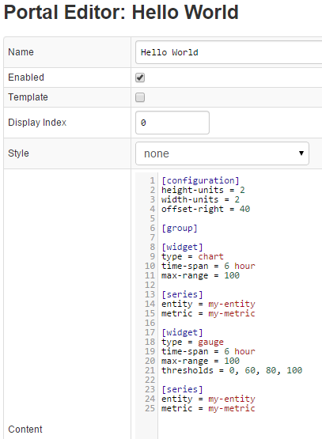
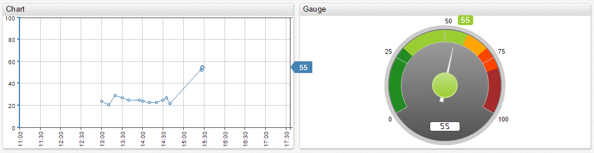

##### Step 7:

Create a sample portal containing Time Chart and Gauge widgets in the Portal Editor located under the Admin tab: [http://atsd_server:8088/portals/edit](http://atsd_server:8088/portals/edit)

View the created portal from top menu drop-down called Portals, you will see the created Hello World portal there.

Copy the following configuration into Portal Settings Editor page, press SAVE:

```
[configuration]
height-units = 2
width-units = 2
offset-right = 40
 
[group]
 
[widget]
type = chart
time-span = 6 hour
max-range = 100
 
[series]
entity = my-entity
metric = my-metric
 
[widget]
type = gauge
time-span = 6 hour
max-range = 100
thresholds = 0, 60, 80, 100
 
[series]
entity = my-entity
metric = my-metric
```



Resulting Portal:



[Use our Visualization guide to add more widgets to the portal.](https://axibase.com/products/axibase-time-series-database/visualization/)

[Continue to Next Page](getting-started-3.md)

