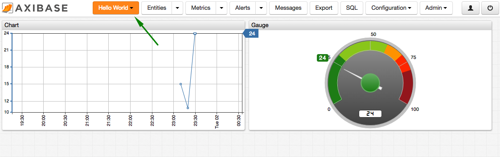

# Getting Started: Part 2

### Create Portal

Open Portal Editor located on the **Configuration: Portals** page.

Copy the following configuration into the Content area. Enter a portal name. Press [Save]:

```ls
[configuration]
  height-units = 2
  width-units = 2
  time-span = 12 hour

[group]

  [widget]
    type = chart
    [series]
      entity = my-entity
      metric = my-metric

  [widget]
    type = gauge
    thresholds = 0, 60, 80, 100
    [series]
      entity = my-entity
      metric = my-metric
```

The above configuration defines two widgets: a linear time chart and a gauge.


To view the portal, reload the top menu, click on [Portals] drop-down in the top menu, and select the portal by name.




Review the [basic syntax](https://axibase.com/products/axibase-time-series-database/visualization/widgets/selecting-series/) used to select series.

Refer to [Visualization documentation](https://axibase.com/products/axibase-time-series-database/visualization/) to add more widgets to the portal.

[Continue to Next Page](getting-started-3.md).
