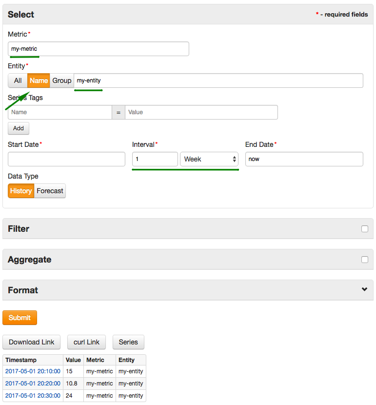
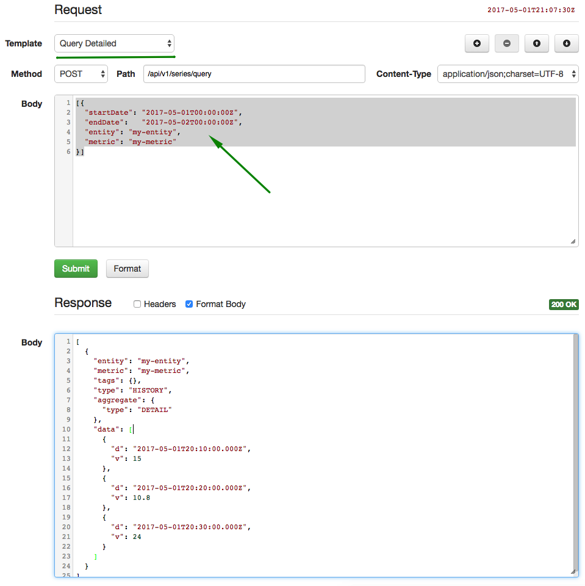

# Getting Started: Part 3

### Export Data

Open the [Export] tab located in the top menu.

Complete the form to download data for the `my-entity` and `my-metric` into a CSV file as well as to displayed it as HTML.



### Execute API Requests

Experiment with [Data API](../api/data/README.md) by executing sample [series query](../api/data/series/query.md) requests using the built-in API client.

Open **Admin: API Client** page, select Series: Query Detailed template.

Adjust `startDate` and `endDate` fields, replace `entity` and `metric` field values accordingly.

* Request

```json
[{
  "startDate": "2017-05-01T00:00:00Z",
  "endDate":   "2017-05-02T00:00:00Z",
  "entity": "my-entity",
  "metric": "my-metric"
}]
```

* Response

```json
 [
  {
    "entity": "my-entity",
    "metric": "my-metric",
    "tags": {},
    "type": "HISTORY",
    "aggregate": {
      "type": "DETAIL"
    },
    "data": [ 
      { "d": "2017-05-01T20:10:00.000Z", "v": 15 },
      { "d": "2017-05-01T20:20:00.000Z", "v": 10.8 },
      { "d": "2017-05-01T20:30:00.000Z", "v": 24 }
    ]
  }
]
```



[Continue to Next Page](getting-started-4.md).
