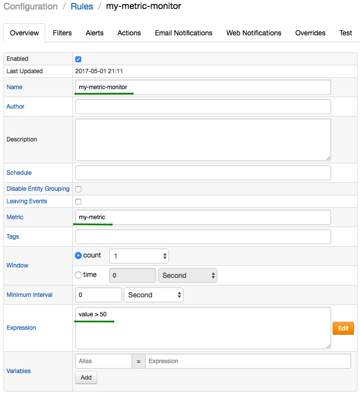
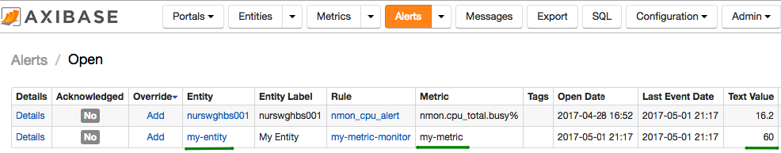
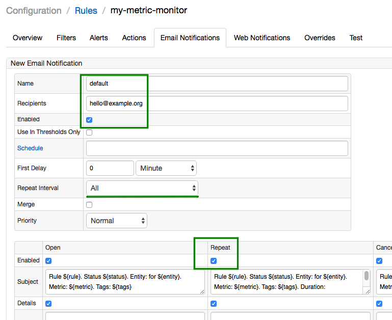

# Getting Started: Part 4

### Alerts

Open **Configuration: Rules** page to create an alert rule for `my-entity` and `my-metric` using the build-in [Rule Engine](../rule-engine).

The following expression will raise an alert if the last value is greater than 50:

```java
value > 50
```



Create the rule manually or import [my-metric-rule.xml](resources/my-metric-rule.xml) file on **Configuration: Rules** > [Import] page.

> Make sure that 'Discard Out-of-Order Values' option is **disabled** on the [Filters] tab.

Return to Data Entry page and submit a new value greater than 50.

Click on Alerts tab in the top menu to review the newly created alert.



Update Time field value to a later timestamp and insert a value smaller than 50. Verify that the alert was deleted.

To receive alert notifications via email, configure the **Admin: Email Client** and specify notification rule on the 'Email Notifications' tab in the Rule Editor.



[Continue to Next Page](getting-started-5.md).

