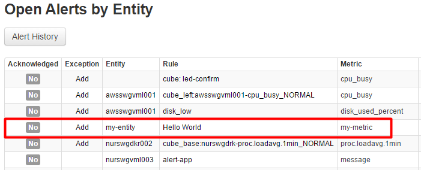

##### Step 10:

Open the [Rule Engine](../rule-engine/rule-engine.md) page located on the main menu bar (labled as Rules) to create an alert rule for my-entity and my-metric: [http://atsd_server:8088/rules](http://atsd_server:8088/rules)

The following expression and settings will raise an alert if the average of the last 3 values is above 50:

```
avg() > 50
```


##### Step 11:

Enter at least 3 values above 50 on the Data Entry page and observe an alert raised on the Alerts page located on the main menu bar: [http://atsd_server:8088/rules/all-alerts.xhtml](http://atsd_server:8088/rules/all-alerts.xhtml)



##### Congratulations! You have reached the end of the Hello World introduction to Axibase Time Series Database. You can continue learning about ATSD on the following pages:

[API](../api/)

[Writing Data](https://axibase.com/products/axibase-time-series-database/writing-data/)

[Reading Data](../api#api-clients)

[Exporting Data](https://axibase.com/products/axibase-time-series-database/exporting-data/)

[Visualization](https://axibase.com/products/axibase-time-series-database/visualization/)

[Rule Engine](../rule-engine/rule-engine.md)
