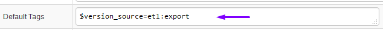
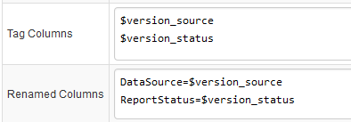
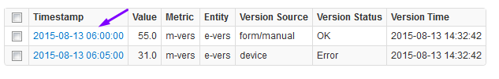
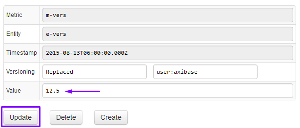
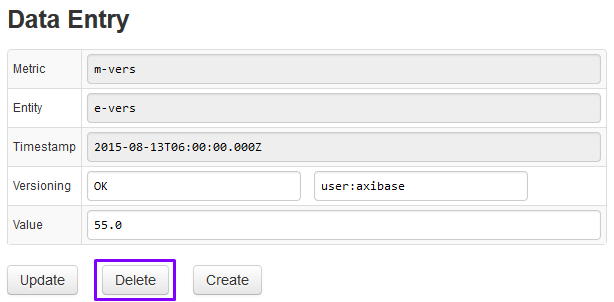
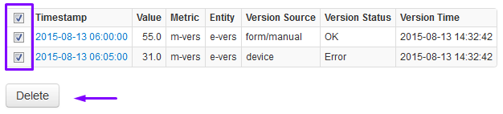

# Versioning

Versioning enables tracking of time-series value changes for the purpose of audit trail and traceable data reconciliation. Once enabled, ATSD tracks changes made to stored values with the following versioning fields:

| Field Name | Description | 
| --- | --- | 
|  
Version Time
  |  
Timestamp when the insert command was received. Set automatically by ATSD server with millisecond precision.
  | 
|  
Version Source
  |  
User-defined field to track sources (origins) of change events such as username, device id, or IP address.
  
Set to `user:{username}` by default for changes made through ATSD web interface.
  | 
|  
Version Status
  |  
User-defined field to classify change events.
  
Set to `Invalid` code if inserted value triggers Invalid Value Action set to SET_VERSION_STATUS in metric editor.
  | 

#### Enabling Versioning

Versioning is disabled by default. It can be enabled for particular metrics by setting Versioning checkbox to selected on Metric Editor page:

In addition, Invalid Value Action can be set to SET_VERSION_STATUS to initialize Version Status field to ‘invalid’ value if inserted sample is outside of specified minimum and maximum bounds.

#### Inserting Version Fields: Network Commands

TO insert versioning fields use reserved series tags $version_source and $version_status. These tags will be removed by the server to populate corresponding versioning fields. If sample value is outside of minimum and maximum bounds specified in metric editor, $version_status will be set to ‘Invalid’.

Note that if metric is unversioned, $version_source and $version_status tags will be processed as regular tags.

#### Inserting Versions with CSV Parser using default tags

If all records in a CSV file should have the same versioning fields, specify $version_source and $version_status in Default Tags.

Note that $version_source and $version_status tags will be applied only to metrics that are enabled for versioning. These reserved tags will be ignored for unversioned metrics.

#### Inserting Versions with CSV Parser using renamed columns

To extract versioning fields from CSV file columns, add $version_source and $version_status to Tag Columns and specify mappings between original column names and reserved tag names in Renamed Columns field.

Note that $version_source and $version_status tags will be applied only to metrics that are enabled for versioning. These reserved tags will be ignored for unversioned metrics.

#### Viewing Versions

Version history can be retrieved on the Ad-hoc Export page or via a scheduled export job.

Click on Versioning checkbox to view version history on Ad-hoc Export page:

- Records with version history are highlighted with blue and brown-colored borders.
- Blue border represents the latest value. Brown border represents a historical, overwritten value.
- NaN (Not a Number) represents deleted values. Deleted values are excluded from aggregation functions.
- For the purpose of API requests, aggregation functions and other calculations, historical values and deleted values are ignored.

#### Viewing Versions with Filters

- Click on ‘Revisions Only’ checkbox to display only values with version history. Values that haven’t been modified will be hidden.
- To display deleted values, enter `Double.isNaN(value)` into Value Filter field.
- To filter version history enter an expression into Version Filter containing version_source, version_status, and version_time fields. Note that version_time fields support endtime syntax with date() function.
` version_source LIKE 'api*'`
` version_status = 'revised'`
` version_time > date('2015-08-13 00:00:00') AND version_time < date('previous_day')`

#### Updating Series Value

Create a report in HTML format on Ad-hoc Export page, with Versioning mode enabled.

Click on Timestamp for the selected record to open Data Entry page.

Set version Status and Source, change the value and click Update.

#### Deleting Series Value

Create a report in HTML format on Ad-hoc Export page, with Versioning mode enabled.

Click on Timestamp for the selected record, optionally modify Status and Source and click Delete button to delete the value.

Note that the value will not be actually deleted, but rather the current value for the selected timestamp will be replaced with a NaN (Not a Number) marker.

#### Deleting Multiple Series Values

To delete multiple values, select checkboxes for the selected rows, or click top checkbox to select all rows, and then click Delete.

#### Scheduled Version Reports

Open Scheduled Export editor, click Versioning checkbox, optionally limit the report only to modified values by checking 'Revision Only' field.

